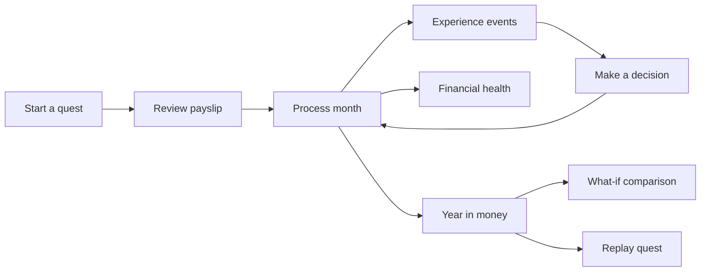
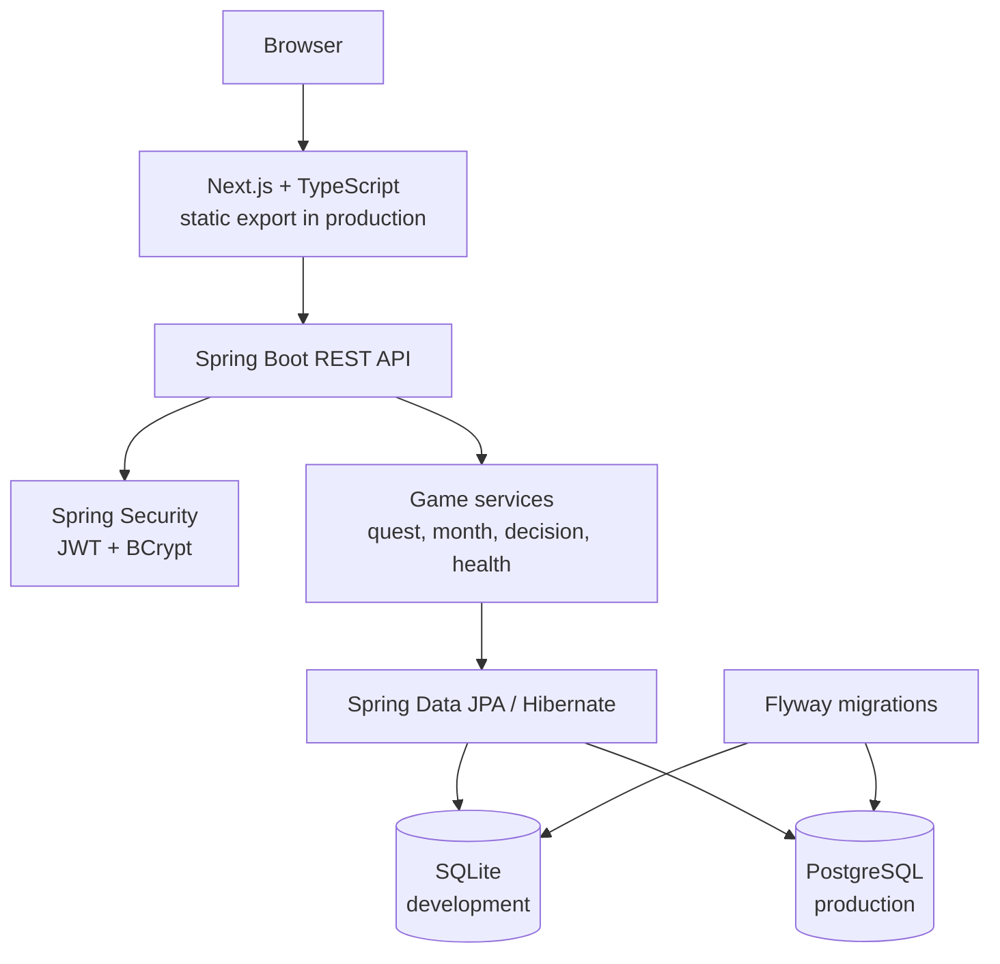

# MoneyQuest

> Live a financial year before it happens.

MoneyQuest is an interactive 12-month financial life simulation for young South African professionals. It turns everyday choices—housing, transport, technology, family support, savings, debt, and unexpected events—into a playable story with visible long-term consequences.

The goal is simple: make money feel understandable before the decisions become expensive.

**Repository:** [github.com/Eleazarovich/moneyquest](https://github.com/Eleazarovich/moneyquest)<br>
**Hosted demo:** Not deployed yet; run the complete app locally with Docker Compose.<br>
**API contract:** [`openapi.yaml`](openapi.yaml)

## Why MoneyQuest exists

Personal finance is often taught as a list of rules, but real decisions are connected. A more expensive home changes what is affordable next month. A phone contract becomes a future commitment. A family emergency tests whether savings are available when they are needed.

MoneyQuest makes those connections tangible by giving the player a first year of financial independence to navigate. It is an educational simulation, not financial advice.

## What you can do

- Start a new quest with an optional seed.
- See a payslip with gross salary, PAYE, UIF, and net income.
- Process a month and respond to decisions about housing, transport, technology, clothing, savings, travel, and lifestyle.
- Experience probabilistic life events such as family support, emergencies, bonuses, side income, and refunds.
- Watch recurring commitments and debt repayments affect future cash flow.
- Inspect financial health across five dimensions: resilience, liquidity, debt load, saving habit, and lifestyle balance.
- Review a year-in-money summary with spending breakdowns, monthly cash flow, annualised surprises, and key decisions.
- Explore “what if?” forks to compare an alternative choice with the path actually taken.
- Replay the quest and see how a different run unfolds.

## See the flow



The fastest way to experience it is the Docker Compose setup below. A new quest can be started without creating an account; account registration and login are also available through the API.

## Quickstart

### Option 1: Run the complete app with Docker Compose

Prerequisites:

- Docker Engine with Compose

From the repository root:

```bash
docker compose up --build
```

Open [http://localhost:8080](http://localhost:8080). The stack starts:

- the MoneyQuest Spring Boot application;
- PostgreSQL 16; and
- the statically exported Next.js frontend, served by Spring Boot.

For anything beyond local development, provide a strong JWT secret instead of the Compose fallback:

```bash
MONEYQUEST_JWT_SECRET="replace-with-a-random-secret-of-at-least-32-bytes" \
  docker compose up --build
```

Stop the stack with `Ctrl+C`, or run:

```bash
docker compose down
```

### Option 2: Run the frontend and backend separately

Prerequisites:

- Java 21;
- Node.js 22 or newer; and
- npm.

Start the backend in one terminal. Its default `dev` profile uses SQLite at `backend/data/moneyquest.db`.

```bash
cd backend
./mvnw spring-boot:run
```

Start the frontend in another terminal:

```bash
cd frontend
npm install
npm run dev
```

Open [http://localhost:4028](http://localhost:4028). In development, the frontend uses `http://localhost:8080` as its API by default. Set `NEXT_PUBLIC_API_BASE_URL` if the backend runs somewhere else.

## API documentation

The checked-in [`openapi.yaml`](openapi.yaml) is the API contract. When the backend is running, the generated documentation is available at:

- Swagger UI: [http://localhost:8080/swagger-ui.html](http://localhost:8080/swagger-ui.html)
- OpenAPI JSON: [http://localhost:8080/v3/api-docs](http://localhost:8080/v3/api-docs)
- OpenAPI YAML: [http://localhost:8080/v3/api-docs.yaml](http://localhost:8080/v3/api-docs.yaml)

The public bootstrap flow is:

1. `POST /api/quests` with an optional `{"seed": 42}`. The response includes a signed `accessToken`.
2. `POST /api/quests/{id}/start` to create the initial player state.
3. Send the token as `Authorization: Bearer <token>` to access the run endpoints.

For example:

```bash
curl -sS -X POST http://localhost:8080/api/quests \
  -H 'Content-Type: application/json' \
  -d '{"seed":42}'

curl -sS -X POST http://localhost:8080/api/quests/<quest-id>/start
```

Protected run endpoints include current state, month processing, decisions, financial health, year-in-money, what-if simulations, and replay. The API also exposes `POST /api/auth/register` and `POST /api/auth/login`; passwords are stored with BCrypt.

## Configuration

### Backend

The default profile is `dev`.

| Variable | Development default | Purpose |
| --- | --- | --- |
| `SPRING_PROFILES_ACTIVE` | `dev` | Selects the `dev` or `prod` configuration. |
| `DATABASE_URL` | `jdbc:sqlite:./data/moneyquest.db` | JDBC connection URL. Required for `prod`. |
| `DATABASE_USERNAME` | empty | Database username. Required for PostgreSQL. |
| `DATABASE_PASSWORD` | empty | Database password. Required for PostgreSQL. |
| `MONEYQUEST_JWT_SECRET` | Development fallback | JWT signing key; use a random secret of at least 32 bytes outside local development. |
| `MONEYQUEST_JWT_EXPIRATION` | `PT12H` | JWT lifetime in ISO-8601 duration format. |
| `MONEYQUEST_CORS_ORIGINS` | Localhost frontend origins | Comma-separated allowed browser origins. |

The `prod` profile uses PostgreSQL, validates the schema with Hibernate, and lets Flyway run the migrations. The application deliberately uses JPA/Hibernate so the same domain model works with SQLite in development and PostgreSQL in production.

### Frontend

| Variable | Default | Purpose |
| --- | --- | --- |
| `NEXT_PUBLIC_API_BASE_URL` | `http://localhost:8080` in development; same origin in production | API base URL used by the browser client. |

## Architecture



The gameplay catalog is code-backed and seeded into the database at startup. Tax configuration is migration-backed. A quest stores its seed, player state, commitments, debt accounts, savings buckets, transactions, decisions, and experienced events so the API can reconstruct the journey and produce summaries.

## Repository structure

```text
.
├── openapi.yaml                    # API contract
├── Dockerfile                      # Multi-stage frontend + backend image
├── docker-compose.yaml             # Local PostgreSQL + application stack
├── Makefile                        # Common backend and Docker commands
├── backend/
│   ├── pom.xml                     # Spring Boot / Java 21 dependencies
│   ├── mvnw                        # Maven Wrapper
│   ├── src/main/java/              # API, security, services, entities
│   ├── src/main/resources/db/      # Flyway migrations
│   └── src/test/                   # API and PostgreSQL integration tests
└── frontend/
    ├── package.json                # Next.js scripts and dependencies
    ├── src/app/                    # Landing page and game screens
    ├── src/components/             # Shared UI components
    └── src/services/               # REST client and domain types
```

The frontend service layer is wired to the real backend client. `mockGameService.ts` remains as a reference fixture for the original in-memory simulation and its tests; it is not the production client selected by [`frontend/src/services/index.ts`](frontend/src/services/index.ts).

## Development commands

Run these from the repository root unless noted otherwise:

| Command | Purpose |
| --- | --- |
| `make run` | Start the backend with the SQLite development profile. |
| `make test` | Run the backend test suite. |
| `make verify` | Run `clean verify`, including the Maven verification lifecycle. |
| `make package` | Build the backend executable JAR. |
| `make docker-up` | Build and start the PostgreSQL-backed application stack. |
| `make docker-down` | Stop the Docker Compose services. |
| `cd frontend && npm run type-check` | Run the TypeScript compiler without emitting files. |
| `cd frontend && npm run build` | Build the static Next.js export. |

The PostgreSQL integration test uses Testcontainers and is skipped when Docker is unavailable. The backend API integration tests run against the SQLite test profile.

## Technical decisions

- **JPA/Hibernate over database-specific persistence:** SQLite keeps local setup lightweight, while PostgreSQL is available for production-like deployments. The entity and repository model stays portable.
- **Flyway with `ddl-auto: none`:** schema changes are explicit, reviewable, and applied consistently across environments.
- **A static Next.js export served by Spring Boot in the container:** the production image can be deployed as one application container while local frontend development remains fast and independent.
- **Anonymous quest bootstrap with a signed token:** someone can try the simulation immediately without an account. Account endpoints are available when persistent identity is needed.
- **Seeded event selection:** an optional quest seed makes the scenario path inspectable and helps reproduce a run while developing or debugging.

## Scope and limitations

MoneyQuest is intentionally a teaching simulation, not a complete personal-finance planner.

- The current scenario is centred on a Johannesburg first-job experience and uses a single seeded 2026/27 tax configuration.
- The decision and life-event catalogue is finite and currently stored in the application code.
- There is no hosted demo or CI/CD workflow in this repository yet.
- The frontend still contains reference tests for the legacy mock service; the primary automated integration coverage is in the backend.
- Tax, debt, and financial-health calculations are simulation rules and should not be treated as personalised financial, tax, or credit advice.

## Future work

The next improvements should follow from those boundaries:

1. Add a hosted demo with production secrets and observability.
2. Add browser-level tests for the main quest flow and backend-client integration tests for the real frontend service.
3. Move scenario content and tax configurations toward versioned, user-selectable datasets.
4. Add CI checks for backend tests, Testcontainers verification, frontend type-checking, and the production build.

## Contributing

Small, focused changes are easiest to review. Before opening a pull request:

1. Update the OpenAPI contract first when an API shape changes.
2. Add or update backend integration coverage for behaviour changes.
3. Run the relevant Maven and frontend checks.
4. Keep README claims, commands, paths, and limitations aligned with the current implementation.

## License

No license has been published for this repository yet. Until one is added, the source should be treated as all-rights-reserved and not assumed to be available for redistribution.
